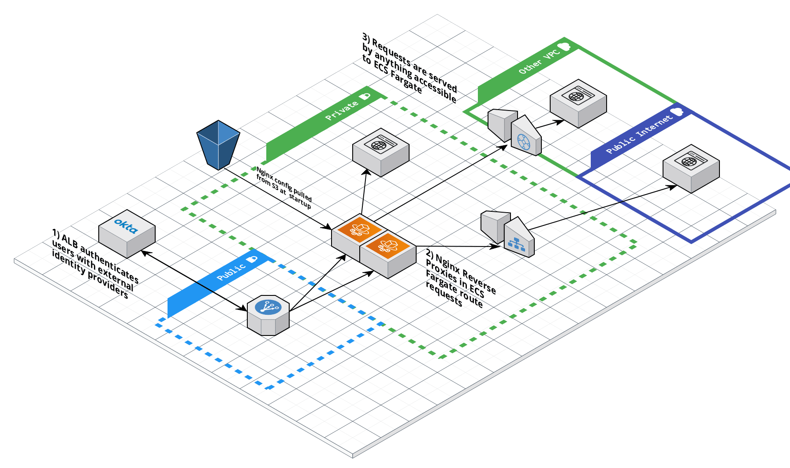

# simple-browser-auth

## This is still in Alpha. Use at your own risk.

## Quickstart

Set environment variables with some information for the Okta and AWS Terraform providers

```
export OKTA_ORG_NAME="example"
export OKTA_BASE_URL="okta.com"
export OKTA_API_TOKEN="XXXXXXXXXXXXXXXXXXXXXXXXXXXXXX"
export AWS_DEFAULT_REGION="us-east-2"
```

In your module, specify a base domain name that all resources will be subdomains of, a Route53 hosted zone for that base domain name, an ACM certificate_arn for a wildcard cert of the base domain name, and your base okta url. These must match the region and Okta settings set in environment variables.

```

module "simple-browser-auth" {

  source = "github.com/deadsimpleauth/simple-browser-auth/module"

  base_okta_url    = "example.okta.com"
  base_domain_name = "deadsimpleauth.com"
  certificate_arn  = "arn:aws:acm:us-east-2:8584927483112:certificate/75fa027f-gr2f-4422-af66-d68f1b7fe2b5"
  route53_zone_id  = "Z94203957Y3X92S9BROET"
  ....
```
The final portion is all the listeners. This is a list of maps. Each map must have the subdomain it will be available at, the DNS domain of the HTTPS resource, and what Okta groups are authorized to access the resource.

```
  authed_listeners = [
    {
      subdomain            = "http-cat"
      origin               = "http.cat"
      assigned_okta_groups = ["89ehdafe8g9dj9w8eh9a"]
    },
    {
      subdomain            = "ifconfigme"
      origin               = "ifconfig.me"
      assigned_okta_groups = ["00few0g9dau43fjdkh43"]
    },
    {
      subdomain            = "blog"
      origin               = "blog.benjamin-hering.com"
      assigned_okta_groups = ["00djieowaji938d9wfegt"]
    },
  ]
```
After that, `terraform init` and `terraform apply`

For this quickstart, this will create http-cat.deadsimpleauth.com, ifconfigme.deadsimpleauth.com, and blog.deadsimpleauth.com, each requiring membership in the associated Okta groups and signing in via Okta to access.

## Why this project

I've often found myself sucked unintentionally into supporting VPNs as a security device. I've never found someone who liked a VPN, usually at best they're tolerated as a clunky, but unavoidable part to get work done. As someone responsible for VPNs I see them often as time bombs, just counting down to the next emergency patch, bandwith saturation or general failure that handicaps other people just trying to get stuff done.

However, VPNs are often a quick, simple way to get authentication for humans bolted on to arbitrary resources. All you have to do is chuck something in a private subnet accessible to the VPN and you get authentication tied to your identity provider, one click provisioning and deprovisioning of user access, and confidence that traffic is at least encrypted over the VPN link.a

This project is designed to make quick drop of authentication for humans for browser based resources as equally simple, but without the overhead of managing VPN devices and their failure modes.a

Objectives:

- Simplicity to admin. All configuration besides the resources you access behind it - identity provider, AWS, nginx - is managed in Terraform.
- Simplicity for users. Users type in the subdomain for the resource they want. If they're authenticated, they get it. If they're not, they authenticate into the same identity provider they use for everything else.
- Leverage managed resources to reduce attack surface and risk. In this system, the only items on the public internet are the AWS managed Application Load Balancer, AWS managed Cognito authentication, and your identity provider (currently only Okta is supported). Nothing on the public internet that you need to patch, and a much simpler, smaller attack surface.

## What this does

Makes a simple, IaaC managed method to drop authentication in front of any HTTPS resource accessed on a browser by humans.

## What this doesn't do

Anything else you expect of a VPN;
- no network connection between devices
- no arbitrary TCP/UDP connections or non-HTTPS protocols (SSH, kubectl, curling APIs)
- no attack surface you need to patch on the public internet

This also doesn't handle restricting your resources to only the Dead Simple Auth managed code. See Restricting Resources for more.

# Flow Diagram



# Restricting resources

Just like a VPN, resources aren't natively aware of the authentication in front of it. If you wish to go further to lock resources down to access only to the authenticated system here, you have the same options available to you as a VPN.

- Restrict the resource to the security groups of the Nginx containers (internal resources), the IP of the NAT gateway (external resources) or like most VPNs simply rely on your private network as a trusted zone, and this authenticator as the arbitrator of access into the trusted zone. Unlike a VPN, access with this is not all or nothing, so even treating all internal resources as single trusted zone still allows you to allow more fine grained access based on group to resources in the zone. This does increase the failure domain of any compromise of the private network to all resources (but so does your old VPN)

##TODO
Remove if/or group code


